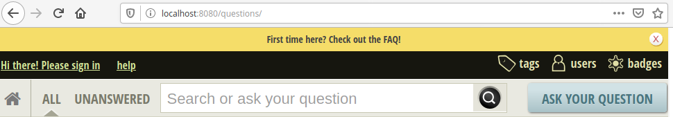

# Askbot - a Django Q&A forum platform

This is Askbot project - open source Q&A system, like StackOverflow, Yahoo Answers and some others.
Askbot is based on code of CNPROG, originally created by Mike Chen 
and Sailing Cai and some code written for OSQA.

Forked from: 

- https://github.com/software-architect-tools/askbot
- https://github.com/ASKBOT/askbot-devel

Ready to use with Docker and Heroku

# Requirements

- Mysql pre-existent database <= 5.7 (execute this script ./database/db_initial.sql)
- Docker

# Variables

| name      | sample value | description |
|---------------------|------------------|---------------|
| DATABASE_NAME | asbot_db         | name of pre-existent database          |
| DATABASE_USER | jane            | user to connect into database           |
| DATABASE_PASSWORD | changeme        | password to connect into database   |
| DATABASE_HOST | 192.168.1.X        |  host to connect into database             |
| DATABASE_PORT | 3306        | port to connect into database          |
| ADMIN_ALIAS | admin        | django admin alias             |
| ADMIN_EMAIL | admin@admin.com        | django admin mail|
| SECRET_KEY | changeme        | django internal seed |
| STARTUP_COMMAND | runserver        | django command to start server |
| PORT | 8080        | django required internal port | 
| DJANGO_DEBUG | True        | django enable debug. Other value: False|
| TIME_ZONE | America/Lima        | Just the timezone|
| EMAIL_HOST | smtp.gmail.com        | smtp host|
| EMAIL_PORT | 587        | smtp port |
| EMAIL_HOST_USER | user@gmail.com        | smtp user |
| EMAIL_HOST_PASSWORD | changeme        | smtp password |
| EMAIL_SUBJECT_PREFIX | Askbot:       | mail destiny subject|
| EMAIL_USE_TLS | True        | smtp tls |
| DEFAULT_FROM_EMAIL | Askbot noreply@gmail.com | used as from alias in email alerts. If is null, ADMIN_EMAIL is used. |
| BEFORE_STARTUP_COMMAND | django command | used if some django task is required before the normal startup. Sample: collectstatic |


# How run with docker + mysql

```sh
docker build -t askbot:latest .

export DATABASE_NAME="asbot_db"
export DATABASE_USER="jane"
export DATABASE_PASSWORD="changeme"
export DATABASE_HOST="192.168.1.X"
export DATABASE_PORT="3306"
export ADMIN_ALIAS="admin"
export ADMIN_EMAIL="admin@admin.com"
export SECRET_KEY="******"
export STARTUP_COMMAND=runserver
export PORT=8080
export DJANGO_DEBUG=True
export TIME_ZONE="America/Lima"
export EMAIL_HOST="smtp.gmail.com"
export EMAIL_PORT="587"
export EMAIL_HOST_USER="auth_user@gmail.com"
export EMAIL_HOST_PASSWORD="*****"
export EMAIL_SUBJECT_PREFIX="Askbot: "
export EMAIL_USE_TLS="True"
export DEFAULT_FROM_EMAIL="Askbot noreply@gmail.com"
export BEFORE_STARTUP_COMMAND=""

docker run --name askbot-app -p 8080:8080 \
-e DATABASE_NAME=$DATABASE_NAME \
-e DATABASE_USER=$DATABASE_USER \
-e DATABASE_PASSWORD=$DATABASE_PASSWORD \
-e DATABASE_HOST=$DATABASE_HOST \
-e DATABASE_PORT=$DATABASE_PORT \
-e ADMIN_ALIAS=$ADMIN_ALIAS \
-e ADMIN_EMAIL=$ADMIN_MAIL \
-e SECRET_KEY=$SECRET_KEY \
-e STARTUP_COMMAND=$STARTUP_COMMAND \
-e PORT=$PORT \
-e DJANGO_DEBUG=$DJANGO_DEBUG \
-e TIME_ZONE=$TIME_ZONE \
-e EMAIL_HOST=$EMAIL_HOST \
-e EMAIL_PORT=$EMAIL_PORT \
-e EMAIL_HOST_USER=$EMAIL_HOST_USER \
-e EMAIL_HOST_PASSWORD=$EMAIL_HOST_PASSWORD \
-e EMAIL_SUBJECT_PREFIX=$EMAIL_SUBJECT_PREFIX \
-e EMAIL_USE_TLS=$EMAIL_USE_TLS \
-e DEFAULT_FROM_EMAIL=$DEFAULT_FROM_EMAIL \
-d askbot:latest
```

# How to run with Heroku

- Create an application
- Create the required variables
- Push this code

# Home Page

http://locahost:8080



# Contributors

<table>
  <tbody>
    <td>
      
      <br />
      <label><a href="http://jrichardsz.github.io/">Richard Leon</a></label>
      <br />
    </td>    
  </tbody>
</table>


# License, copyright and trademarks

Askbot software is licensed under GPL, version 3.

Copyright Askbot S.p.A and the project contributors, 2010-2017.

"Askbot" is a trademark and service mark registered in the United States, number 4323777.
